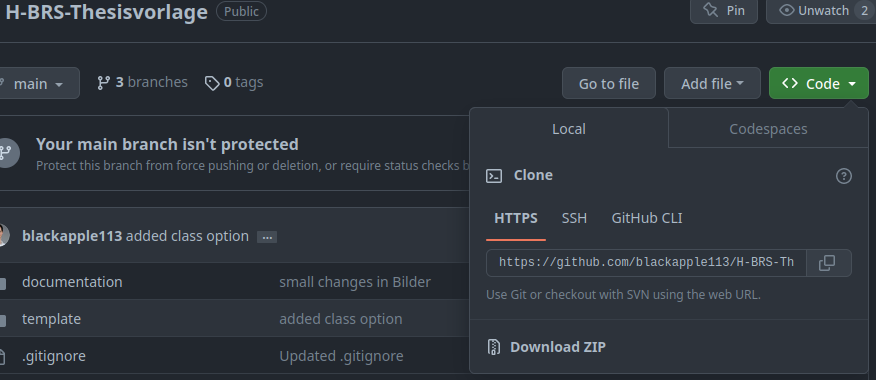
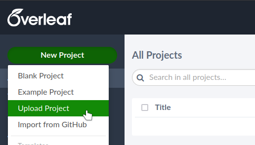
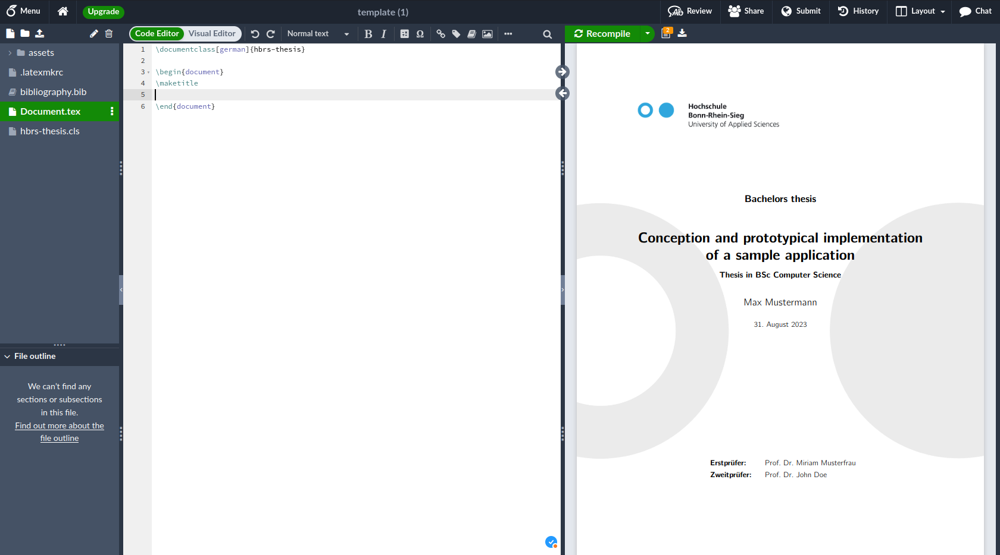
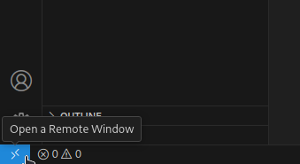
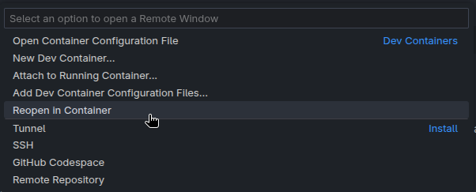

# H-BRS Thesisvorlage <!-- omit in toc -->

Diese Dokumentvorlage ist ein Ansatz eine modernere, zuverlässiger konfigurierte und einfacher zu verwendende LaTeX-Vorlage zum Schreiben von Abschlussarbeiten und Projektberichten zur Verfügung zu stellen.

## Inhalt <!-- omit in toc -->
- [Roadmap](#roadmap)
- [Setup](#setup)
  - [Overleaf](#overleaf)
  - [VS Code](#vs-code)
    - [Manuell](#manuell)
    - [Container](#container)
    - ~~[Dev Container](#dev-container)~~

## Roadmap

* [x] Klassendatei bereitstellen, die ohne großen Aufwand verwendet werden kann.
* [x] Setup Guide für:
  * [x] Overleaf
  * [x] VS Code
    * [x] Manuell
    * [x] Container
    * [x] Dev Container
* [ ] Beispieldokument erstellen, in denen die wichtigsten Eigenschaften der LaTeX-Klasse gezeigt und erklärt werden (in Arbeit, siehe `Documentation.pdf`).
* [x] Docker Container erstellen, der das Bauen übernimmt ohne, dass die notwendige Software auf dem Rechner installiert sein müssen.
* [ ] Kleines Programm erstellen was erlaubt die notwendigen Dateien als Template herunterzuladen und direkt mit dem Schreiben anzufangen.

## Setup

Lade dieses Projekt entweder als `.zip`-Datei herunter und entpacke es oder Klone das Projekt über die URL `https://github.com/blackapple113/H-BRS-Thesisvorlage.git`. Navigiere danach in das Projektverzeichnis um den beschriebenen Setup-Möglichkeiten folgen zu können.

### Overleaf
Komprimiere den Ordner `template` in eine `.zip`-Datei. Gehe dann auf [Overleaf](https://overleaf.com) und Logge dich ein. Nach dem Einloggen oben links auf den Button `Neues Projekt` klicken und im Menü die Option `Projekt hochladen` auswählen.

Im erscheinenden Fenster kann die vorher erstellte `.zip`-Datei per *Drag and Drop* hochgeladen werden. Nach dem Hochladen wird das Kompilieren automatisch angestoßen und das Deckblatt sollte nach kurzer Zeit erscheinen.

Zu Beginn sollten die Angaben auf dem Deckblatt angepasst werden. Diese befinden sich unter `assets/utility/meta.tex`. Jetzt kann das Schreiben beginnen. 

**Viel Erfolg!**

### VS Code

Für VS Code gibt es unterschiedlichste Möglichkeiten diese Vorlage zu nutzen. Wird eine Open Source Variante von VS Code verwendet ([Code - OSS](https://github.com/microsoft/vscode), [VSCodium](https://vscodium.com/)) können [Dev Container](https://containers.dev/) leider nicht verwendet werden [(danke Microsoft!)](https://github.com/microsoft/vscode-remote-release/issues/1886#issuecomment-561493608). Für die folgende Installationsanleitung sollte also VS Code und entsprechende Erweiterungen installiert werden:

**VS Code:**
- Visual Studio Code
  - Windows: [Visual Studio Code](https://code.visualstudio.com/)
  - macOS: [Visual Studio Code](https://code.visualstudio.com/)
  - Ubuntu: [Visual Studio Code](https://code.visualstudio.com/)
  - Arch: `sudo pacman -S code` (open source), `yay -S visual-studio-code-bin` (official binary version)

**Erweiterungen für VS Code:**
- [LaTeX Workshop](https://marketplace.visualstudio.com/items?itemName=James-Yu.latex-workshop)
- [LTeX](https://marketplace.visualstudio.com/items?itemName=valentjn.vscode-ltex) (empfohlen)

#### Manuell

**Notwendige Software:**
- [TeX Live Full](https://tug.org/texlive/)
  - Windows: [install-tl-windows.exe](https://tug.org/texlive/windows.html) herunterladen und ausführen.
    - Im Fenster `TeX Live Installationsprogramm` unten links `Fortgeschritten` auswählen.
    - In der größeren Auswahl lediglich die Option `Installiere TeXworks als Frontend` abwählen (wir verwenden ja schließlich VS Code).
    - Dauer der Installation je nach Internetverbindung: **ca. 1,5 Stunden**
  - macOS: [MacTeX](https://www.tug.org/mactex/mactex-download.html)
  - Ubuntu: [Quick Install TeX Live](https://tug.org/texlive/quickinstall.html)
  - Arch (AUR): `yay -S texlive-full`
- [Inkscape](https://inkscape.org/) (wird für die Konvertierung von SVG-Grafiken benötigt)
  - Windows: [Inkscape](https://inkscape.org/)
  - macOS: [Inkscape](https://inkscape.org/)
  - Ubuntu: `sudo add-apt-repository ppa:inkscape.dev/stable && sudo apt update && sudo apt install inkscape`
  - Arch: `sudo pacman -S inkscape`
- [Python](https://www.python.org/) und [Pygments](https://pygments.org/) (für Syntax Highlighting im Dokument)
  - Windows:
    - [Python](https://www.python.org/)
    - Pygments: In der Konsole oder PowerShell: `pip install Pygments`
  - macOS:
    - [Python über Homebrew](https://docs.brew.sh/Homebrew-and-Python)
    - [Python über Website](https://www.python.org/)
    - Pygments: Im Terminal: `pip install Pygments`
  - Arch:
    - Python: `sudo pacman -S python`
    - Pygments: `sudo pacman -S python-pygments`
  - Fedora:
    - Python: `sudo dnf install python`
    - Pygments: `sudo dnf install python-pygments`

<!-- - (eventuell muss noch `biber` über die TeX Live Paketverwaltung heruntergeladen werden mit `tlmgr install biber`) -->

Nach der Installation der Software und der Extensions müssen die Einstellungen in VS Code noch angepasst werden. Über das Menü `Anzeigen` → `Befehlspalette` die Befehlspalette öffnen und dort `Benutzereinstellungen` eingeben und `Einstellungen: Benutzereinstellungen öffnen (JSON)` auswählen. In die Einstellungen wird dann je nach Betriebssystem die Einstellung aus `assets/settings/linux_mac.json` bzw. `assets/settings/windows.json` eingefügt.

#### Container

**Notwendige Software:**
- Docker
  - Windows: [Docker Desktop](https://www.docker.com/products/docker-desktop/)
  - macOS: [Docker Desktop](https://www.docker.com/products/docker-desktop/)
  - Ubuntu: [Docker Desktop](https://www.docker.com/products/docker-desktop/)
  - Arch: `sudo pacman -S docker`
  - Fedora: [Docker Desktop](https://www.docker.com/products/docker-desktop/)

Gehe in den Ordner `template` oder kopiere diesen Ordner als Grundlage der neuen Arbeit aus dem aktuellen Verzeichnis an eine neue Stelle. Innerhalb des `template`-Ordners befindet sich ein Dockerfile, welches das Basisimage für das LaTeX-Projekt darstellt. Solange ich es nicht geschafft habe ein Dockerimage direkt zur Verfügung zu stellen, muss das Image selbst gebaut werden mit `docker build -t build-latex .`. Dieser Vorgang dauert 5 - 10 Minuten, muss danach aber nicht mehr wiederholt werden.

Nachdem das Image `build-latex` vorhanden ist, kann das LaTeX-Dokument mit dem Befehl `docker run -v .:/tmp build-latex Document.tex` gebaut werden. Achte dabei darauf, dass du dich in dem Ordner des Templates befindest, da das *volume* sonst nicht korrent ist. Soll das Kompilieren im Dockercontainer von Hand gestartet und beliebig angepasst werden, wird das mit dem folgenden Befehl erreicht: `docker run -v .:/tmp -u latex -it --entrypoint /bin/sh build-latex`. Innerhalb des Containers wird die Kompilierung mit `./build-latex.sh Document.tex` angestoßen.

#### Dev Container

⚠️ Funktioniert nach aktuellen Tests unter Fedora 43 leider nicht, wird aber korrigiert! ⚠️

**Notwendige Software:**
- Visual Studio Code
  - Windows: [Visual Studio Code](https://code.visualstudio.com/) (Microsoft Build)
  - macOS: [Visual Studio Code](https://code.visualstudio.com/) (Microsoft Build)
  - Ubuntu: [Visual Studio Code](https://code.visualstudio.com/) (Microsoft Build)
  - Arch: `sudo pacman -S code` (open source), `yay -S visual-studio-code-bin` (official binary version)
  - Fedora: [Visual Studio Code](https://code.visualstudio.com/) (Microsoft Build)
- Docker
  - Windows: [Docker Desktop](https://www.docker.com/products/docker-desktop/)
  - macOS: [Docker Desktop](https://www.docker.com/products/docker-desktop/)
  - Ubuntu: [Docker Desktop](https://www.docker.com/products/docker-desktop/)
  - Arch: `sudo pacman -S docker`
  - Fedora: [Docker Desktop](https://www.docker.com/products/docker-desktop/)

**Erweiterungen für VS Code**

**Die folgende Erweiterung ist nur mit den offiziellen Microsoft Versionen kompatibel (Microsoft Build):**
- [Dev Containers](https://marketplace.visualstudio.com/items?itemName=ms-vscode-remote.remote-containers)

Der Ordner `template` kann aus dem heruntergeladenen Repository an eine beliebige Stelle kopiert und beliebig umbenannt werden. Vor der Verbindung zum Dev Container muss sichergestellt sein, dass Docker auf dem System läuft (Windows und macOS: Es muss Docker Desktop laufen). Nach Öffnen des Ordners in VS Code kann auf das blaue Rechteck unten links in der Ecke von VS Code geklickt werden.

Es öffnet sich die Befehlspalette in der mehrere Optionen zur Auswahl stehen. Die Option "Im Container erneut öffnen" auswählen und nach dem Starten des Containers (kann beim ersten Mal, je nach Internetverbindung, einige Minuten dauern) kann in die Datei `Document.tex` geschrieben werden.

Das Bauen des Dokumentes geschieht automatisch beim Speichern der Datei oder beim Klicken auf den grünen Play-Button oben rechts in der Ecke.

<!-- Vor der Verwendung des Templates sollte sichergestellt werden, dass [Inkscape](https://inkscape.org/de/), [Python](https://www.python.org) und das Pythonpaket [Pygments](https://pygments.org/) auf dem System installiert sind.

Danach kann die Ordnerstruktur `template` einfach als Vorlage für das Dokument verwendet werden. `Document.tex` ist die Hauptdatei, in der alles geschrieben oder mit `\input` importiert wird. Ich empfehle die Aufteilung der Kapitel/Abschnitte in einzelne Dateien in den Ordner `chapter`. Als Klassenoption muss mindestens die Sprachangabe `german` oder `english` gegeben werden.

Angaben über den Titel des Dokuments, den Autor usw. finden sich unter `template/assets/utility/meta.tex`. Das muss einmal gesetzt werden und bleibt dann in der Regel fix. Für den Buildprozess sollte `latexmk` verwendet werden.

⚠️ Weitere Informationen für die Verwendung der Klasse folgen im Beispieldokument. ⚠️ -->
